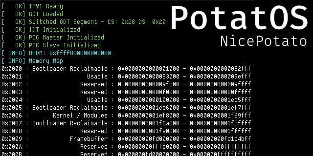

# PotatOS

Potato Operating System for Potato Computers

 

> [!WARNING]
> README still a WIP

# About this Project

PotatOS is an operating system and kernel made completely from scratch by one person. It is made in C++ with some assembly.

# Info

## Supported Architectures

- [x] - AMD64 / x86_64
- [ ] - IA32 / x86 (Future support is planned)
- [ ] - RISC-V
- [ ] - AARCH64 / ARM64

# Todo

Remake build system in new language

> [!NOTE]
> RISC-V and ARM64 may come later on in development, but not current priority

# Tools

## Required

* wget - To download project-specific tools
* unzip - Self-explanatory
* make - Builds makefiles
* xorriso - ISO creation and manipulation
* limine - Bootloader installer
* jq - Command-line JSON tool

## Optional

* qemu-full - My emulator of choice
* compiledb - For clangd

## Tools included or automatically installed

* limine - Bootloader created by mintsuki
* \[arch\]-elf-gcc - Cross compiler for target architecture (plus misc gcc related tools)

